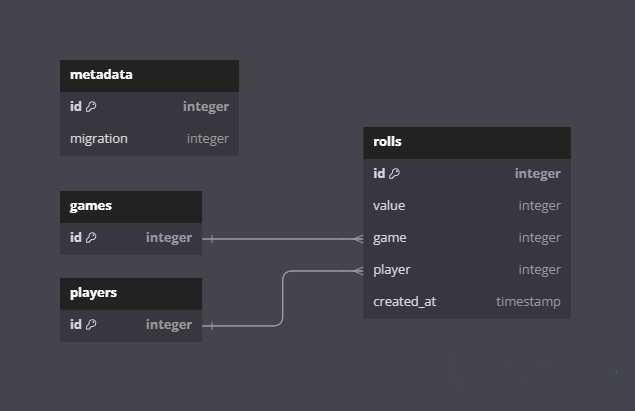

# Datenbanken Projekt

Quellcode zum Projekt für das Datenbanken-Labor an der Heinrich-Hertz-Schule
Karlsruhe.

Wir verwenden die [SQLite](https://www.sqlite.org/) Datenbank, weil sie ohne
Server funktioniert und damit jegliche Installation und Setup wegfällt.
SQLite speichert die Daten in einer Datei lokal auf der Festplatte ab. Mit
Programmen wie dem [DB Browser for SQLite](https://sqlitebrowser.org/) können
die Daten und die Struktur der Datenbank eingesehen werden.

## Datenbank

Die Daten werden in vier Tabellen abgelegt:
- metadata: Enthält Metadaten unseres Programmes
- games: Enthält Einträge für jedes gespielte Spiel
- players: Enthält Einträge für jeden Spieler
- rolls: Enthält alle Würfelwürfe jedes Spielers jedes Spieles sowie der
  Zeitpunkt des Würfelns
